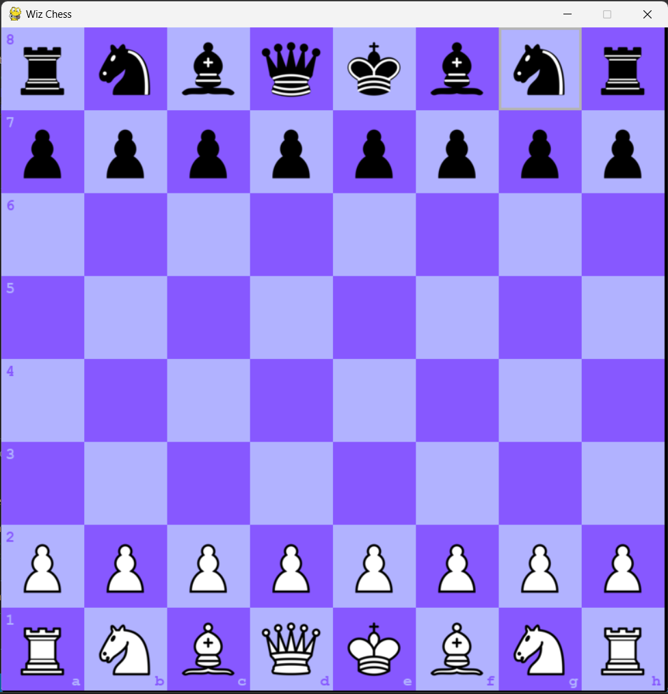
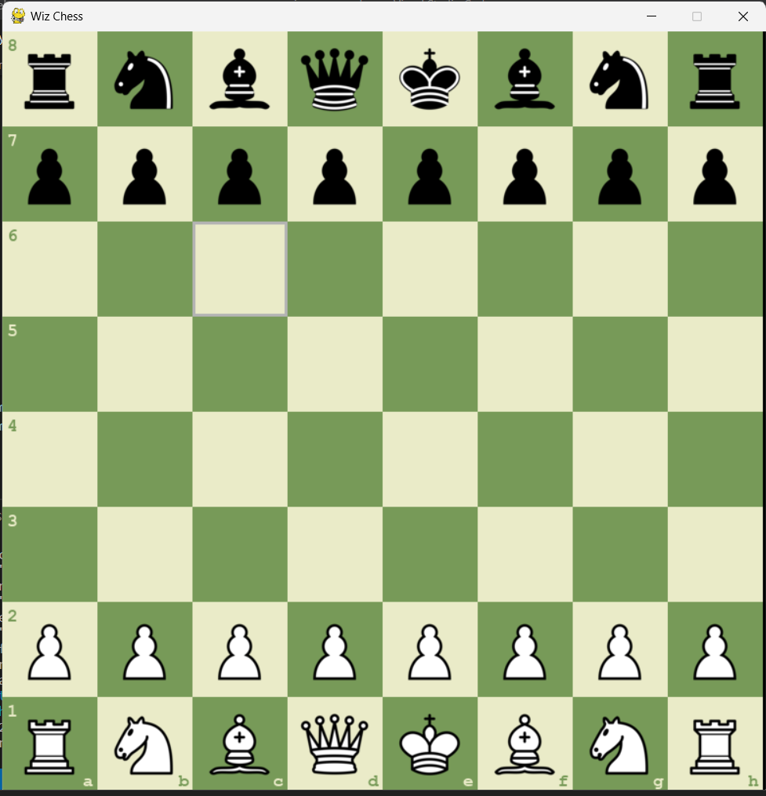
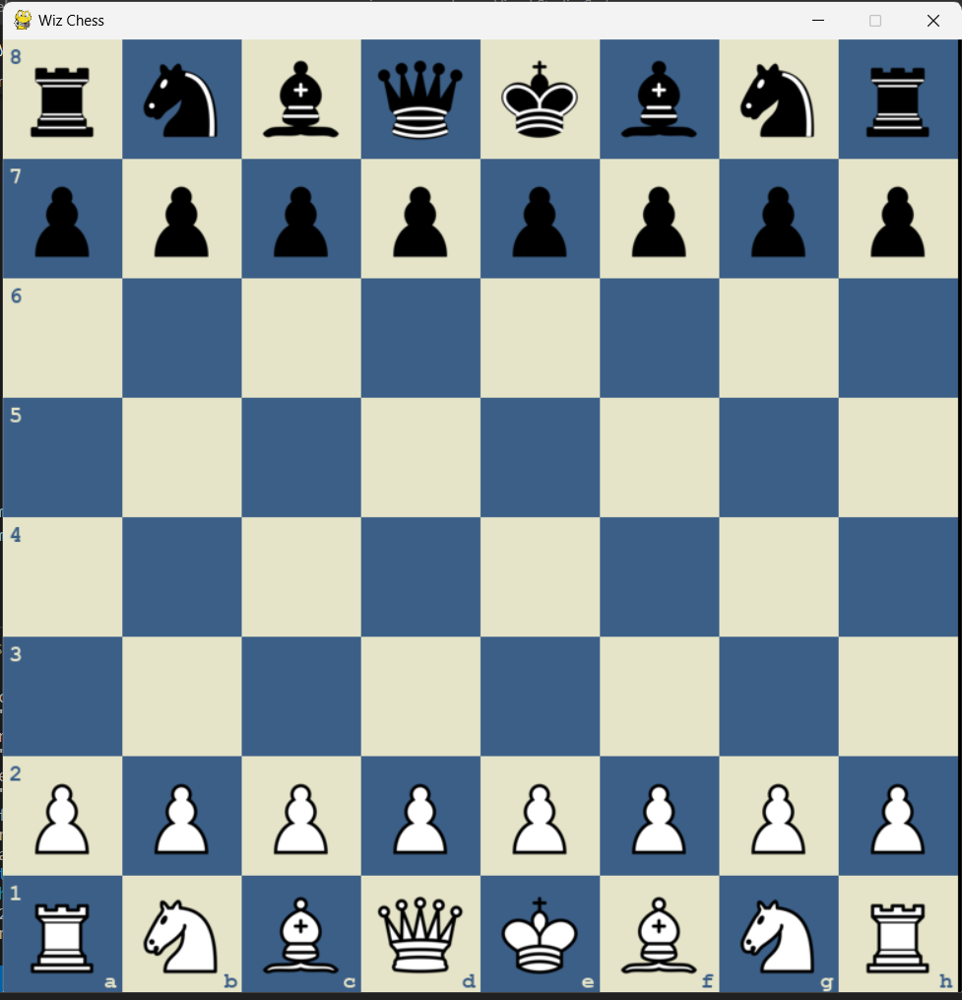
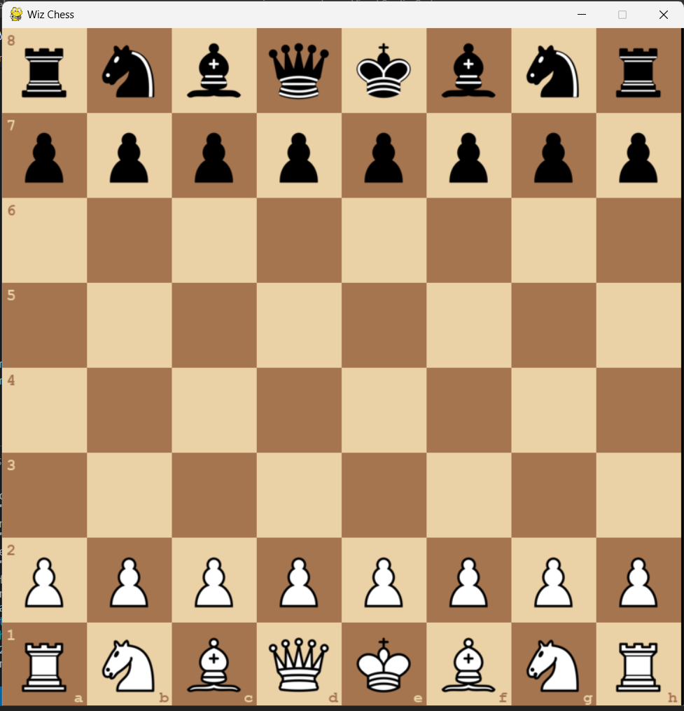
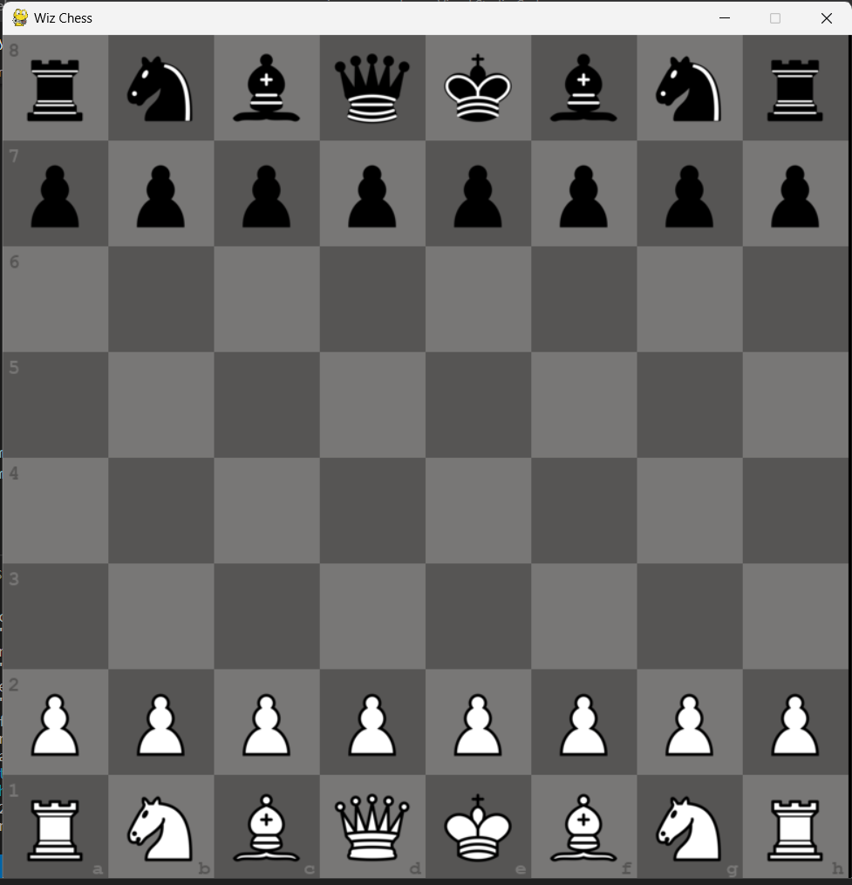
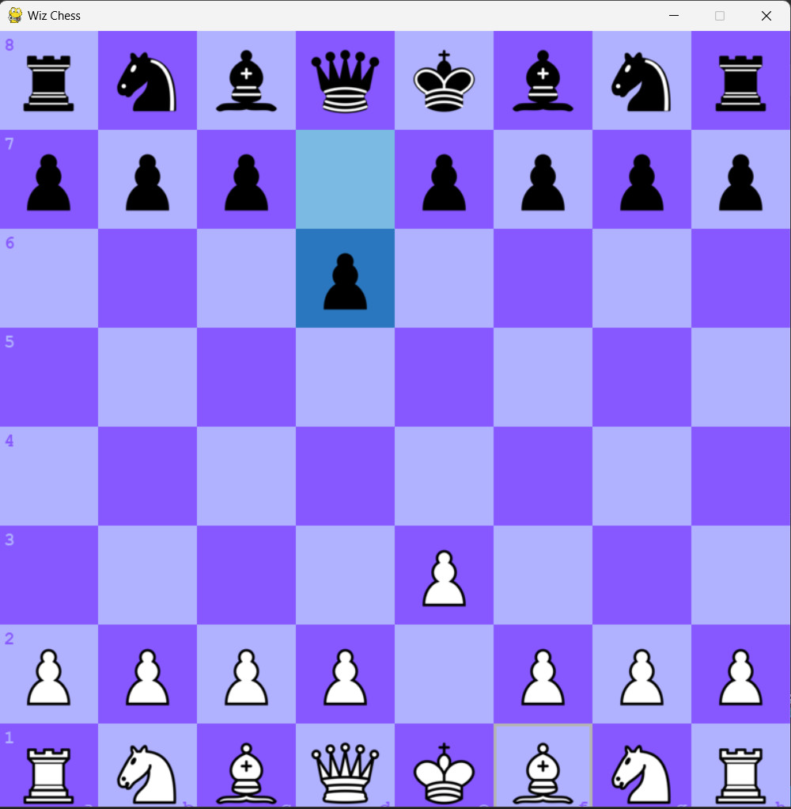
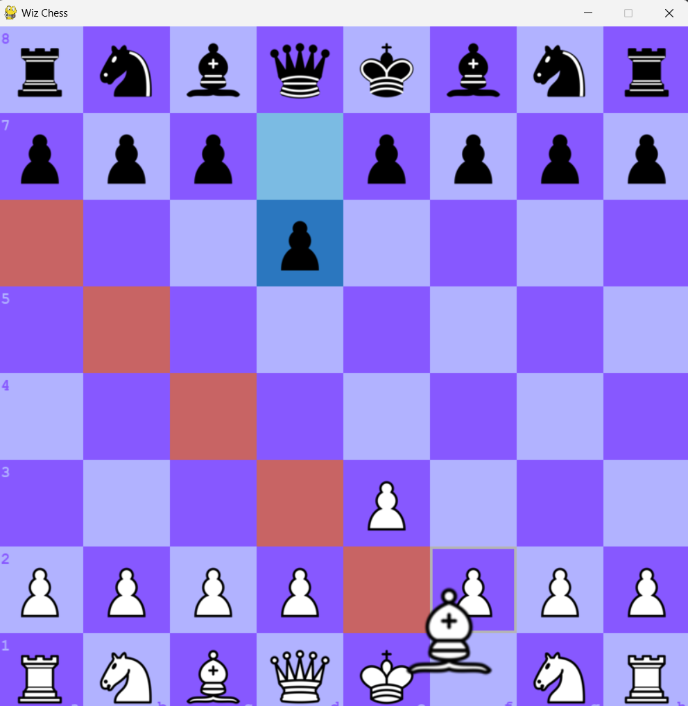
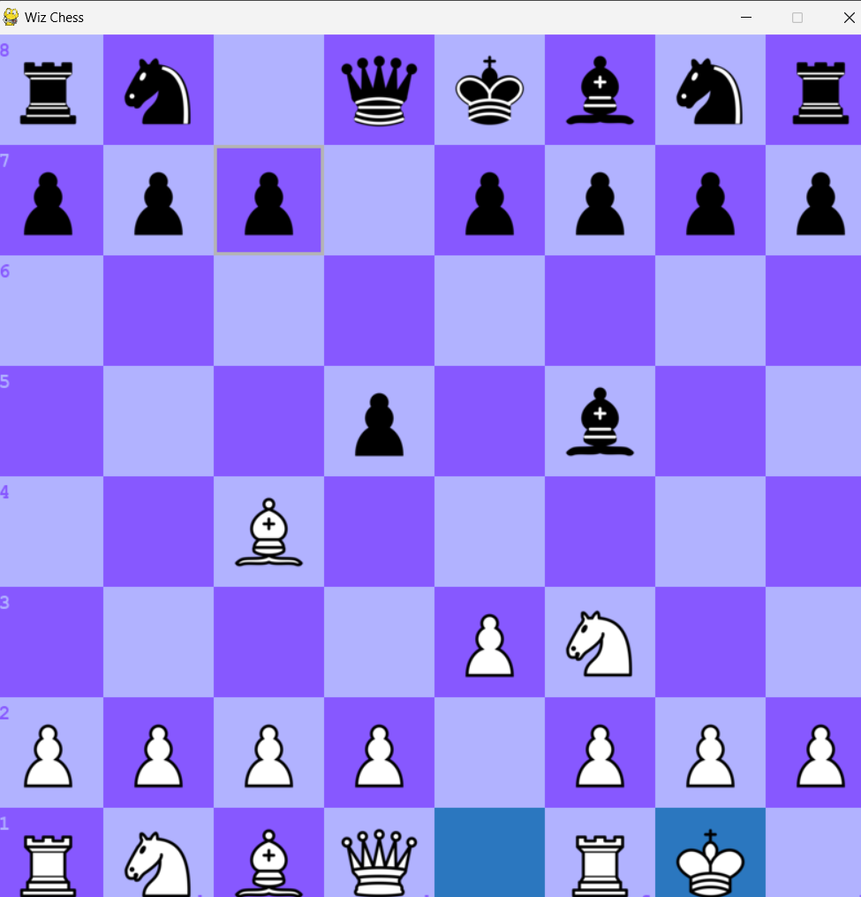
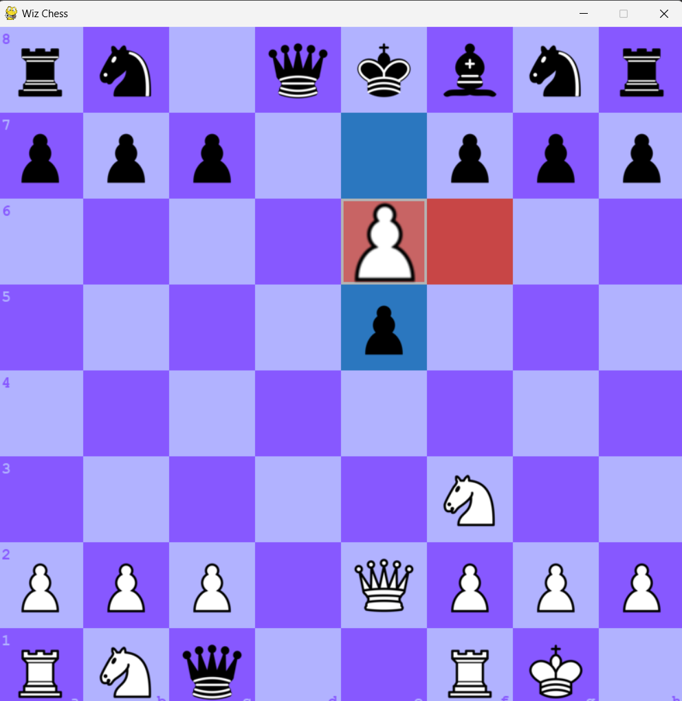
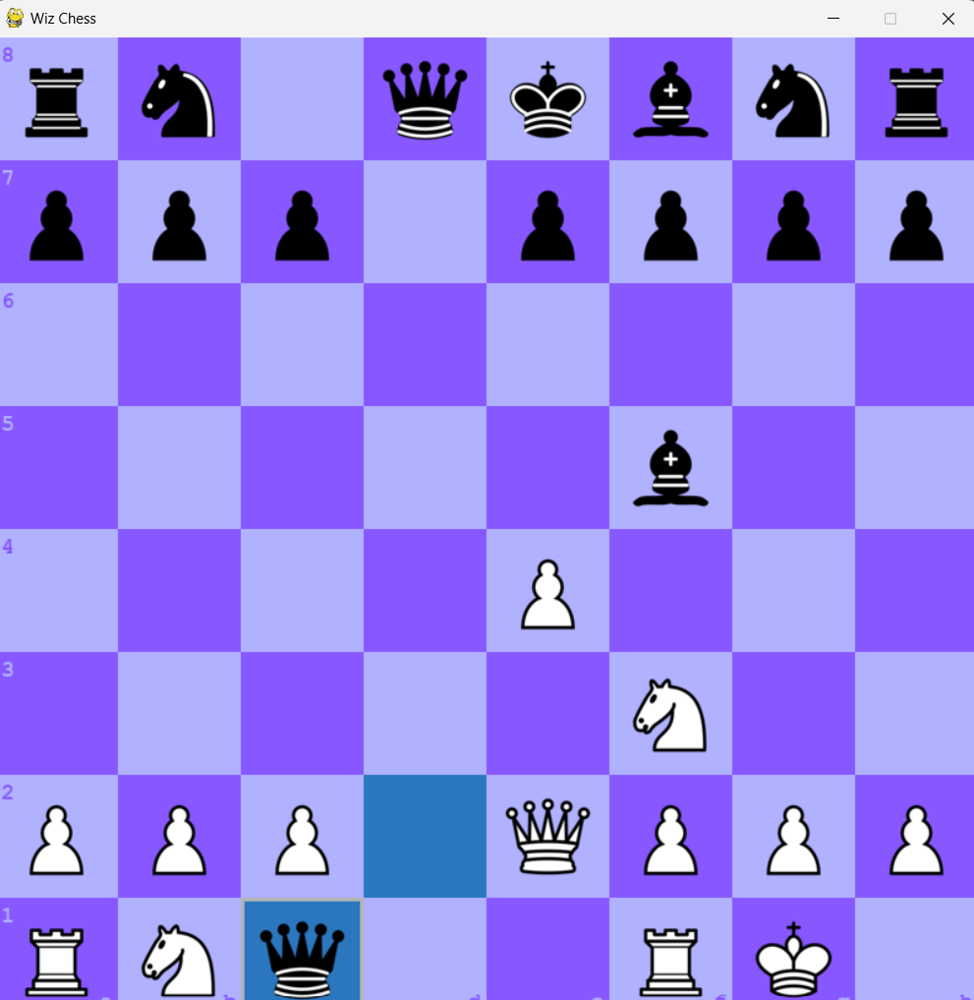

# Player VS Player Chess
A simple player vs player chess made only with python and pygame

---

## Features
- 5 changable themes
- sound on move and capture
- minimalistic 2d design
- move assist
- castling, en-passant

---

## Instructions
### Moving a piece
Use your mouse to drag and drop a piece to valid position to move
### Changing the theme
Use your keyboard key <kbd>T</kbd> to change the theme
### Reseting the board
Use your keyboard key <kbd>R</kbd> to reset the game board

---

## Snapshots
### Purple Theme (Default)

### Green Theme

### Blue Theme

### Brown Theme

### Grey Theme

### Moves

### Move Assist

### Castling

### En-Passant

### Pawn Promotion

---

Hope you enjoy!
